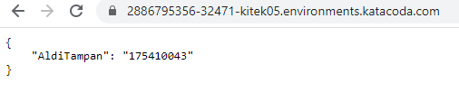

##### Laurentius Rezaldi Pradana Putra / 175410043 

1.Pertama-tama saya akan membuat image dengan Python Flask


`alditampan69/tampan-flask:v1`
- Dockerfile
```dockerfile

FROM python:2.7
COPY . /app
WORKDIR /app
RUN pip install -r requirements.txt
ENTRYPOINT ["python"]
CMD ["app.py"]

```
- app.py
```python
# app.py - a minimal flask api using flask_restful
from flask import Flask
from flask_restful import Resource, Api

app = Flask(__name__)
api = Api(app)

class HelloWorld(Resource):
    def get(self):
        return {'AldiTampan': '175410043'}

api.add_resource(HelloWorld, '/')

if __name__ == '__main__':
    app.run(debug=True, host='0.0.0.0')

```
- requirements.txt
```
flask
flask_restful
```

# Kubernetes
1. Membuat deployment untuk image tampan-flask
```bash
$ kubectl create deployment tampan-flask --image=alditampan69/tampan-flask:v1
deployment.apps/tampan-flask created
```
2. Membuat service untuk meng-expose port 5000 image tampan-flask
```bash
$ kubectl expose deployment tampan-flask --type=LoadBalancer --port=5000
service/tampan-flask exposed
```
3.  Mengecek Service yang sedang berjalan
```bash
$ kubectl get services
NAME         TYPE           CLUSTER-IP     EXTERNAL-IP   PORT(S)          AGE
tampan-flask   LoadBalancer   10.96.92.134   <pending>     5000:32471/TCP   61s
kubernetes   ClusterIP      10.96.0.1      <none>        443/TCP          54m
```
4. Terlihat port 5000 di expose ke port 32471
```bash
$ kubectl get services
NAME         TYPE           CLUSTER-IP     EXTERNAL-IP   PORT(S)          AGE
tampan-flask   LoadBalancer   10.96.92.134   <pending>     5000:32471/TCP   61s
kubernetes   ClusterIP      10.96.0.1      <none>        443/TCP          54m
```
5. Jalankan melalui browser


6. Link Docker Image :
https://hub.docker.com/repository/docker/alditampan69/tampan